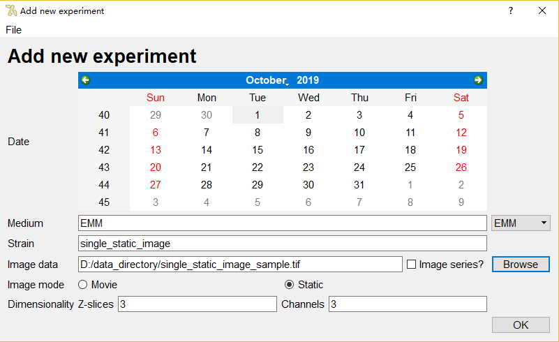
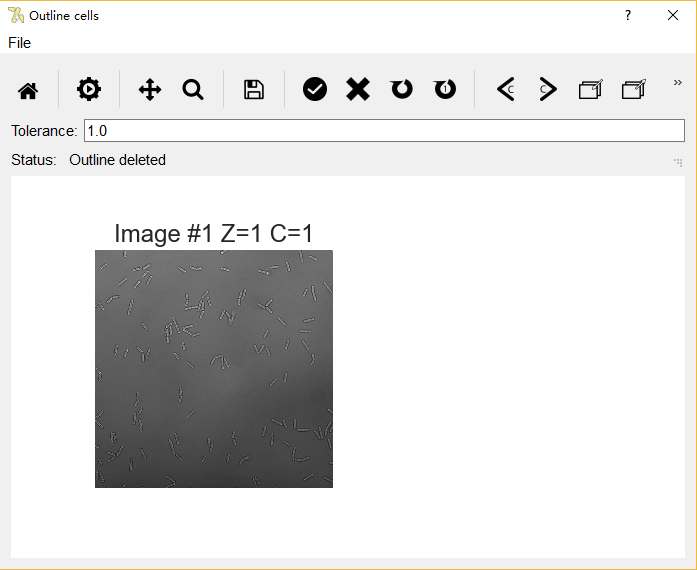
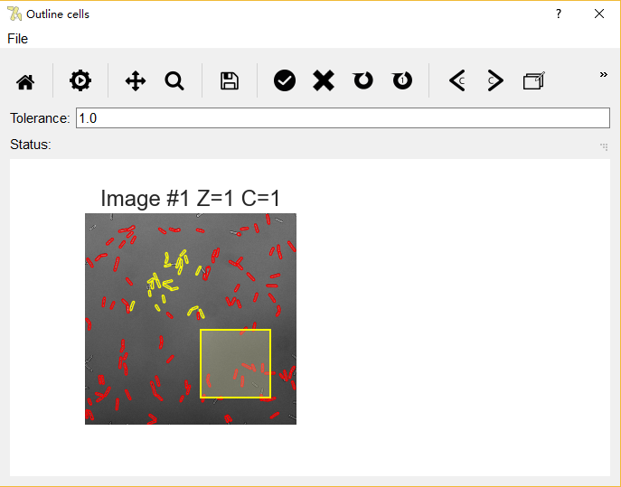

# PombeTrack
Interface to permit the partially automated tracking of Schizosaccharomyces pombe cells from time-lapse data (especially ONIX data).
# Tutorial

## 1. Launch the software
In the root of this repository, launch Pombetrack with python in command line:
```
  python Pombetrack
```

or :
```
  ./Pombetrack 
```

if in Linux.

The following main window will be shown:


## 2. Add new experiment:

From the main window, click “Add new experiment” button to launche a window for importing new data.



Three types of data are supported: a single static image, a series of static images, and a single time-lapse image (movie). 

For single static image and time-lapse image, the “Image series” box should be unticked before clicking “Browse” button. For static image series, the “Image series” box should be ticked before importing.

“Image mode” and “Dimensionality” will be automatically selected, and can be manually modified if the automatic assignment misbehaves.
After data import, new experiments will be added to the main window:


3. View Experiment:

From main window, click “View experiment” button or double click on the experiment row to open a window for processing this experiment. Clicking “Delete experiment” button will remove the current selected experiment row and all associated data. Double clicking on Medium and Strain of the experiment row enables their modification.

The “View Experiment” page:


For automatic segmentation, click “Start Auto”. Progress will be shown in “Status”. Image with a minumum of 3 z-stacks is required for generating proper cell outlines. 

## 4. Outline cells:

To view and manually segment the cells, click “Outline Cells” from the “View Experiment” window. The window initially shows the full image and all existing segmented cells (if any in the database):



In “Outline cells” window, the following bar will be shown at the top:


Functions of the buttons are shown as labelled, and can be found together with keyboard short-cut by navigating the cursor onto the buttons. The Frame changing buttons will only appear when the imported data is time-lapse image.

“Home” button repositions the image and cancels all effect from “Pan” and “Zoom”. “Auto” button runs automatic segmentation for the current image (or time frame) with current “Tolerence” value (explained later), and the segmented cells will be displayed in the image view progressively. “Save” button saves current view into a image file. 

For manual segmentation, select the correct channel, z-stack, then use “Pan” and “Zoom” to help finding the cell to be outlined, and click on interior of the cell:


Click the two “Refine” buttons to evolve the active contour. The left “Refine” button performs 10 steps of evolution, while the right performs a single evolution. “Tolerance” affect how much the contour can progress into the dark region (usually the cell boundaries). “Tolerance” value has a maximum of 100, and can be changed to allow active contour to traverse the dark regions in cell interior. Nodes of the outline in the right panel can also be dragged with mouse cursor to manually adjust the contour when automatic evolution is hindered by heterogeneous cell interior. 

When satisified with the outline, click “Accept” to record coordinates of the outline into database (if the image mode is movie, the image view will automatically switch to the same position of the next frame):


The “Delete” button can be used to remove false contours from automatic or manual segmentation. Multiple selection is available via dragging through the image panel, and selection can be added by clicking or dragging on cells while holding Shift button:

<div style="text-align:center"></div>


After manual or automatic segmentation, the number of segmented cells will appear on the experiment rows of the main window:


